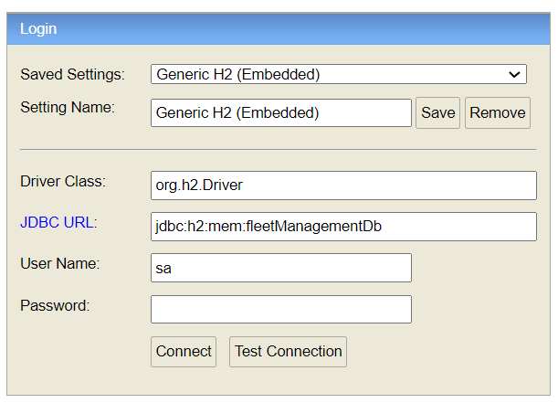

## Fleet Management System

## Summary
This is a small-scale fleet management system application where
vehicles make deliveries to predetermined locations along a certain route.

# Technologies
- Java 8
- Spring boot 2.5.3
- Spring Data JPA
- H2 in-memory DB
- Restful API
- SwaggerAPI documentation
- JUnit5
- Docker
- Docker compose

# Prerequisites
- Maven
- Docker

## Installation

### Git clone
```bash
git clone https://github.com/DevelopmentHiring/YasinAksu.git
```

### Note: 
The system can provide test records to the database for a quick start according to the given test case description pdf file. For this, it will be enough to uncomment `@Component` annotation above the `com.fleetmanagament.dataaccess.dataseeder.InitialDataSeed` class.

# Run & Build


There are 3 ways of run & build the fleet-management-system application.
### 1. Docker ###
```sh
$PORT 9090         
```
To build and run `fleet-management-system` service via docker

```sh 
$ cd fleet-management-system
$ docker build -t fleet-management-system:1.0 .
$ docker run --name fleet-management-system -d -p $PORT:8080 fleet-management-system:1.0
```

### 2. Docker-Compose ###
```sh
$PORT 9191       
```
To build and run `fleet-management-system` service via docker-compose

```sh
$ cd fleet-management-system
$ docker-compose up
```


### 3. Maven ###
```sh
$PORT 8080       
```
To build and run `fleet-management-system` service via maven

```sh
$ cd fleet-management-system
$ mvn clean install
$ mvn spring-boot:run
```


### Swagger UI will be run on this url
`http://localhost:$PORT/swagger-ui.html`

### H2 Database console will be run on this url
`http://localhost:$PORT/h2`

`jdbc url= jdbc:h2:mem:fleetManagementDb`

`user name= sa`

`password = there is no password`



# Usage of the fleet-management-system

### Create Vehicle : HTTP POST method

`http://localhost:$PORT/api/v1/vehicles`
``` js
{
    "licensePlate":"34 TL 34"
}
```

### Create Bag : HTTP POST method

`http://localhost:$PORT/api/v1/bags`
``` js
{
    "barcode": "C999800",
    "deliveryPointValue": 3
}
```

### Create Delivery Point : HTTP POST method

`http://localhost:$PORT/api/v1/deliverypoints`
``` js
{
    "name": "Branch",
    "value": 1
}
```
### Create Package : HTTP POST method

`http://localhost:$PORT/api/v1/packages`
``` js
{
    "barcode": "P7988000121",
    "deliveryPointValue": 1,
    "volumetricWeight":5
}
```

### Assign Package to Bag : HTTP PUT method

`http://localhost:$PORT/api/v1/packages/bag`
``` js
{
    "packageBarcode": "P7988000121",
    "bagBarcode": "C725799"
}
```
### Shipments Distribution : HTTP POST method

`http://localhost:$PORT/api/v1/vehicles/shipments`

The following Request is copied from test case description pdf file
``` js
{
    "plate": "34 TL 34",
    "route": [
        {
            "deliveryPoint": 1,
            "deliveries": [
                {
                    "barcode": "P7988000121"
                },
                {
                    "barcode": "P7988000122"
                },
                {
                    "barcode": "P7988000123"
                },
                {
                    "barcode": "P8988000121"
                },
                {
                    "barcode": "C725799"
                }
            ]
        },
        {
            "deliveryPoint": 2,
            "deliveries": [
                {
                    "barcode": "P8988000123"
                },
                {
                    "barcode": "P8988000124"
                },
                {
                    "barcode": "P8988000125"
                },
                {
                    "barcode": "C725799"
                }
            ]
        },
        {
            "deliveryPoint": 3,
            "deliveries": [
                {
                    "barcode": "P9988000126"
                },
                {
                    "barcode": "P9988000127"
                },
                {
                    "barcode": "P9988000128"
                },
                {
                    "barcode": "P9988000129"
                },
                {
                    "barcode": "P9988000130"
                }
            ]
        }
    ]
}
```

 
